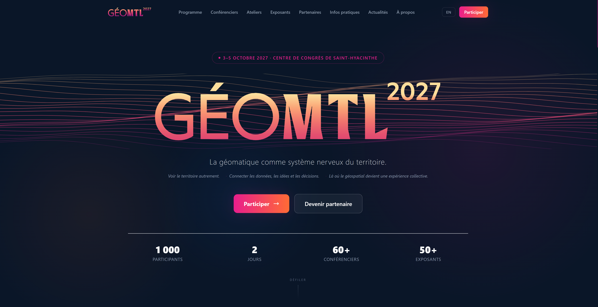

# GeoMTL 2027

Site web officiel de la conférence GeoMTL 2027 — le rendez-vous de la communauté géospatiale francophone.



**4–5 octobre 2027 · Centre de congrès de Saint-Hyacinthe**

---

## Stack technique

- **Framework** : Next.js 14 (App Router, Server Components)
- **Langage** : TypeScript
- **Style** : Tailwind CSS, identité visuelle 2027 (crème, encre, dégradé cyan → citron) ; l'admin garde l'ancienne palette
- **Icônes** : Phosphor Icons, graisse Light
- **Animations** : Framer Motion (entrées) + globe animé en canvas dans le hero
- **i18n** : next-intl (FR / EN)
- **Base de données** : Supabase (PostgreSQL + Auth + Storage)
- **Déploiement** : Vercel

---

## Démarrage local

```bash
npm install
cp .env.local.example .env.local   # remplir les clés Supabase
npm run dev
```

Ouvrir [http://localhost:3000](http://localhost:3000).

### Variables d'environnement requises

```
NEXT_PUBLIC_SUPABASE_URL=
NEXT_PUBLIC_SUPABASE_ANON_KEY=
SUPABASE_SERVICE_ROLE_KEY=          # serveur uniquement, jamais exposé client
NEXT_PUBLIC_SITE_URL=               # pour les emails d'invitation (prod)
```

---

## Structure du projet

```
app/
  [locale]/           Pages publiques FR/EN (Next.js i18n routing)
  admin/              Interface de gestion (protégée, rôle admin/editor)
components/
  home/               Sections de la page d'accueil (Hero, GlobeTrame, WhyAttend, …)
  layout/             Header, Footer, Navigation
  ui/                 Composants réutilisables (GeoMTLLogo, SectionTitle, …)
data/                 Données mock et configuration de l'événement
lib/                  Utilitaires, client Supabase, actions serveur
messages/             Traductions FR/EN (next-intl)
public/images/brand/  Visuels de l'identité 2027 et données du globe animé
scripts/globe/        Scripts de régénération des données du globe
docs/                 Documentation
logo/                 Fichiers SVG du logo GeoMTL 2027
```

---

## Logo

Le logo officiel est `logo/GeoMtl2027_v3_creme-violet.svg` — dégradé crème→violet en 7 paliers.

Le composant React `GeoMTLLogo` dessine le mot-symbole GÉOMTL dans la couleur du texte (encre sur le site). Le hero l'affiche en grand par-dessus le globe animé.

---

## Documentation

- [Globe animé du hero](docs/globe-anime.md) : fonctionnement, réglages, régénération des données
- [Identité visuelle 2027 dans le code](docs/identite-visuelle-2027.md) : couleurs, icônes, visuels

---

## Admin

Accessible à `/admin` après authentification Google OAuth.

Rôles : `admin` (accès complet) · `editor` (sans suppression) · `viewer` (lecture seule)

Pour attribuer le rôle admin à la première connexion :
```sql
UPDATE public.profiles SET role = 'admin' WHERE email = 'ton@email.com';
```

---

## Migrations SQL

Les migrations sont dans `supabase/migrations/` et numérotées `V000` → `V006`.  
Exécuter dans l'ordre via le SQL Editor de Supabase.
